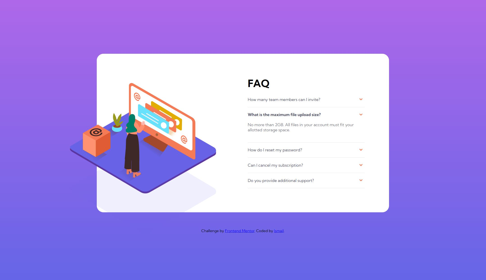

# Frontend Mentor - FAQ accordion card solution

This is a solution to the [FAQ accordion card challenge on Frontend Mentor](https://www.frontendmentor.io/challenges/faq-accordion-card-XlyjD0Oam). Frontend Mentor challenges help you improve your coding skills by building realistic projects.

## Table of contents

- [Overview](#overview)
  - [The challenge](#the-challenge)
  - [Screenshot](#screenshot)
  - [Links](#links)
- [My process](#my-process)
  - [Built with](#built-with)
  - [What I learned](#what-i-learned)
- [Author](#author)

## Overview

To create a faq accordion card component as close to the design files provided.

### The challenge

Users should be able to:

- View the optimal layout depending on their device's screen size
- See hover states for interactive elements

### Screenshot



### Links

- Solution URL: [here](https://github.com/Ishi1834/faq-accordion-card)
- Live Site URL: [here](https://ishi1834.github.io/faq-accordion-card/)

### Built with

- Semantic HTML5 markup
- CSS custom properties
- Flexbox
- Mobile-first workflow
- Vanilla javaScript

### What I learned

How to crop an image and how to use vw for to make a site reponsive:

```css
.image {
  position: absolute;
  clip: rect(auto, auto, auto, 5.5vw);
}
```

```css
.faq {
  position: relative;
  top: -2vw;
  left: -2vw;
  width: 50%;
  padding: 0 3vw;
}
```

```js
if (setClasses) {
  this.classList.toggle("active");
  this.nextElementSibling.classList.toggle("show");
}
```

## Author

- Github - [@Ishi1834](https://github.com/Ishi1834)
- Frontend Mentor - [@Ishi1834](https://www.frontendmentor.io/profile/Ishi1834)
- CodePen - [@sadiq1834](https://codepen.io/sadiq1834)
